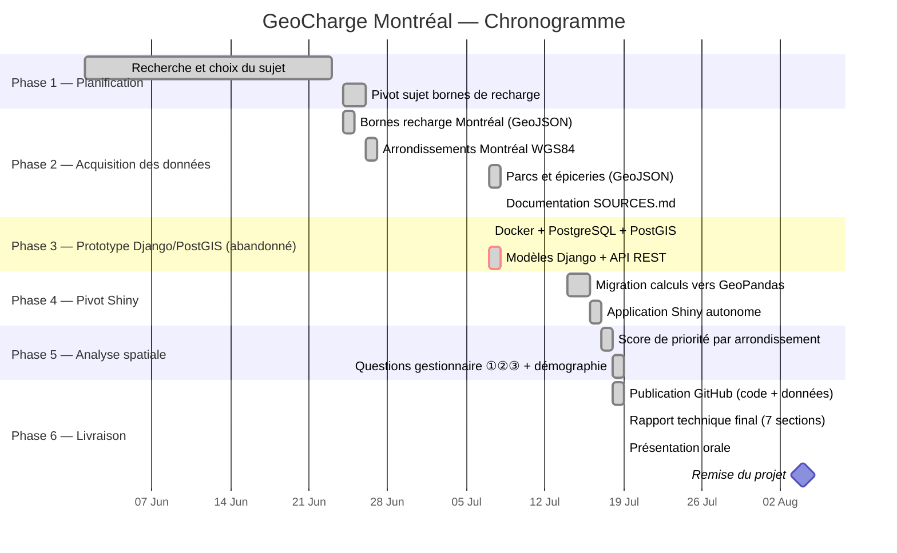

# Chronogramme — GeoCharge Montréal
## GMQ580 — Géomatique Informatique 2 — Été 2026

> **Remise finale : 4 août 2026, minuit**

---

## Vue d'ensemble des phases

| Phase | Description | Statut |
|---|---|---|
| Phase 1 | Planification et choix du sujet | ✅ Complété |
| Phase 2 | Acquisition des données ouvertes | ✅ Complété |
| Phase 3 | Prototype Django + PostGIS + Docker | ⚠️ Abandonné (trop lourd pour une démo en classe) |
| Phase 4 | Pivot vers Shiny for Python + GeoPandas | ✅ Complété |
| Phase 5 | Analyse spatiale et questions de gestionnaire | ✅ Complété |
| Phase 6 | Documentation, rapport, présentation | ✅ Complété |

---

## Diagramme de Gantt

---

## Détail par phase

### Phase 1 — Planification (juin 2026) ✅

| Tâche | Livrable |
|---|---|
| Choix du sujet : accessibilité bornes recharge Montréal | Problématique validée |
| Définition de la question de recherche | Où installer de nouvelles bornes, et qu'est-ce qui explique la répartition actuelle ? |

---

### Phase 2 — Acquisition des données (24 juin – 8 juillet 2026) ✅

| Source | Format | Contenu | Licence |
|---|---|---|---|
| Ville de Montréal (Données Québec) | GeoJSON | 2 412 bornes de recharge publiques | CC-BY 4.0 |
| Ville de Montréal (Données Québec) | GeoJSON | Arrondissements WGS84 (34 unités) | CC-BY 4.0 |
| Ville de Montréal (Données Québec) | GeoJSON | 1 541 parcs et 3 010 épiceries | CC-BY 4.0 |
| Statistique Canada | CSV | Profil démographique, 19 arrondissements (Recensement 2021) | CC-BY 4.0 |
| Ville de Montréal (Données Québec) | CSV | Statistiques d'utilisation des bornes 2025 | CC-BY 4.0 |

---

### Phase 3 — Prototype Django/PostGIS (7 juillet 2026) ⚠️ Abandonné

Une première version utilisait Django, PostgreSQL/PostGIS et Docker pour l'application web. Cette architecture, bien que réaliste pour une mise en production, s'est révélée lourde à faire fonctionner pour une simple démonstration en classe (base de données à démarrer, conteneur à configurer). Elle a été **remplacée** par l'approche décrite en Phase 4.

---

### Phase 4 — Pivot vers Shiny for Python (14–17 juillet 2026) ✅

| Tâche | Résultat |
|---|---|
| Remplacement de PostGIS par GeoPandas (calculs en mémoire) | Aucune base de données requise |
| Remplacement de Django/API REST par Shiny for Python | Application réactive, un seul processus |
| Carte Folium/Leaflet intégrée directement à l'app | `shiny app/app_bornes_recharges.py` |

---

### Phase 5 — Analyse spatiale et questions de gestionnaire (17–19 juillet 2026) ✅

| Tâche | Résultat |
|---|---|
| Score de priorité (déficit de couverture 60 % + densité 40 %) | Beaconsfield, Dollard-des-Ormeaux, Senneville en tête |
| ① Parcs sans borne à proximité (500 m, seuil ajustable) | 1 413 / 1 541 parcs sous le seuil de 20 bornes |
| ② Épiceries sans borne à 300 m | 819 / 3 010 épiceries |
| ③ Corrélation de Pearson (densité, revenu, motorisation, parcs, épiceries) | Densité (r = 0,875) domine, pas le revenu (r = −0,60) |

---

### Phase 6 — Livraison ✅

| Tâche | Fichier | Statut |
|---|---|---|
| Push GitHub complet (code + données) | GitHub | ✅ |
| Rapport technique final | RAPPORT_FINAL.md (remis séparément) | ✅ 7 sections |
| Présentation orale | PRESENTATION_ORALE.pptx (remis séparément) | ✅ |

---

## Jalons clés

| Date | Jalon | Statut |
|---|---|---|
| 24 juin 2026 | Démarrage du projet | ✅ |
| 8 juillet 2026 | Toutes les données acquises | ✅ |
| 7 juillet 2026 | Prototype Django/PostGIS abandonné (trop lourd pour la démo) | ⚠️ |
| 17 juillet 2026 | Pivot vers Shiny for Python complété | ✅ |
| 19 juillet 2026 | Analyse spatiale, questions gestionnaire, documentation finalisés | ✅ |
| **4 août 2026** | **Remise finale du projet** | ⏳ |

---

## Stratégies adoptées

| Défi | Solution choisie |
|---|---|
| Données d'imagerie satellitaire difficiles à obtenir | Pivot vers données ouvertes Ville de Montréal (immédiatement disponibles, CC-BY 4.0) |
| Architecture Django + PostGIS + Docker trop lourde pour une démo en classe | Pivot vers Shiny for Python + GeoPandas, calculs en mémoire, une seule commande à lancer |
| Format des données d'utilisation 2025 (virgule française, guillemets littéraux) | Nettoyage explicite avant conversion numérique |
| Données de revenu StatCan disponibles pour 19 des 34 arrondissements seulement | Corrélation calculée sur les 19 arrondissements couverts, limite documentée dans le rapport |

---

*Chronogramme révisé le 19 juillet 2026 — Équipe : Modou Khabane Mbaye & Rahina Djelila Sarah Bagre*
*GMQ580 Géomatique Informatique 2 — Université de Sherbrooke — Été 2026*
