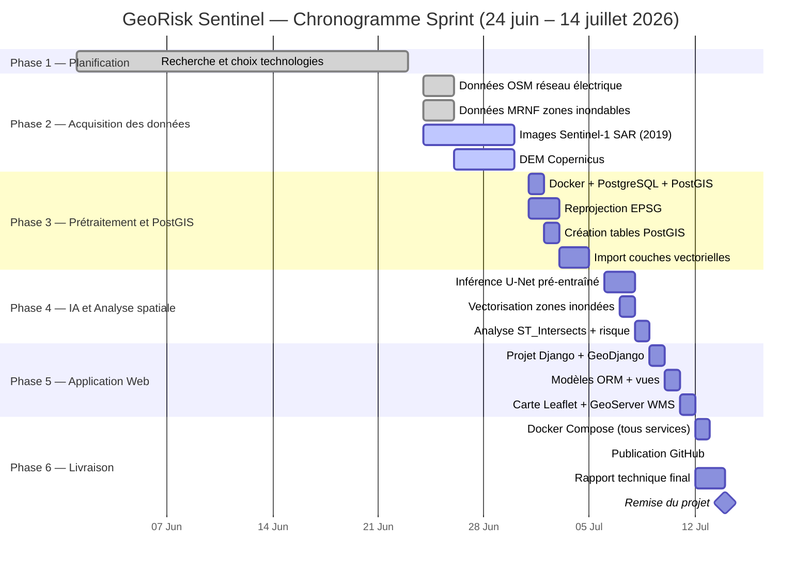

# Chronogramme — GeoRisk Sentinel
## GMQ580 — Géomatique Informatique 2 — Été 2026

> **Contrainte de livraison : avant le 15 juillet 2026**
> Durée totale : 21 jours (24 juin → 14 juillet 2026)

---

## Vue d'ensemble des phases

| Phase | Description | Début | Fin | Durée | Statut |
|---|---|---|---|---|---|
| Phase 1 | Planification et choix des technologies | 1er juin 2026 | 23 juin 2026 | — | ✅ Complété |
| Phase 2 | Acquisition des données | 24 juin 2026 | 30 juin 2026 | 7 jours | 🔄 En cours (démarré) |
| Phase 3 | Prétraitement + PostGIS | 1er juillet 2026 | 5 juillet 2026 | 5 jours | ⏳ À faire |
| Phase 4 | IA (modèle pré-entraîné) + analyse spatiale | 6 juillet 2026 | 9 juillet 2026 | 4 jours | ⏳ À faire |
| Phase 5 | Application Django + Leaflet + GeoServer | 9 juillet 2026 | 12 juillet 2026 | 4 jours | ⏳ À faire |
| Phase 6 | Docker, GitHub, tests et rapport final | 12 juillet 2026 | 14 juillet 2026 | 3 jours | ⏳ À faire |

---

## Diagramme de Gantt (Mermaid — à coller dans Draw.io)

---

## Détail jour par jour

### 24–30 juin 2026 — Acquisition des données (7 jours) — 🔄 EN COURS

| Jour | Tâche | Outil | Livrable |
|---|---|---|---|
| Mar. 24 juin ✅ | Extraction OSM (réseau électrique Sainte-Marthe) | overpy / QGIS | GeoJSON réseau électrique |
| Mar. 24 juin ✅ | Téléchargement zones inondables MRNF | zonesinondables.mrnf.gouv.qc.ca | SHP zones inondables |
| Mer. 25–Jeu. 26 juin ✅ | Planification finale + choix zone d'étude confirmée | — | Documents de planification |
| Ven. 27–Sam. 28 juin | Téléchargement DEM Copernicus | Copernicus Land Service | GeoTIFF DEM |
| Sam. 28–Lun. 30 juin | Images Sentinel-1 SAR (avril 2019, avant/après rupture digue) | sentinelsat (Python) | Images SAR brutes |

> **Note :** Si les images Sentinel ne sont pas accessibles rapidement → utiliser **Google Earth Engine** (interface web, export immédiat).

---

### 2–5 juillet 2026 — Prétraitement et PostGIS (4 jours)

| Jour | Tâche | Outil | Livrable |
|---|---|---|---|
| Jeu. 2 juillet | Lancer Docker + PostGIS + pgAdmin | docker-compose | BD PostGIS opérationnelle |
| Jeu. 2 juillet | Reprojection toutes couches → EPSG:32198 | Rasterio / PyProj | Données cohérentes |
| Ven. 3 juillet | Découpage sur emprise Sainte-Marthe | Rasterio / GeoPandas | Données découpées |
| Ven. 3 juillet | Création des 5 tables PostGIS | SQL / psql | Schéma BD |
| Sam. 4 juillet | Import OSM + MRNF dans PostGIS | ogr2ogr / GeoPandas | Tables peuplées |
| Dim. 5 juillet | Validation des données dans QGIS | QGIS | Carte de vérification |

---

### 6–9 juillet 2026 — IA et Analyse spatiale (4 jours)

| Jour | Tâche | Outil | Livrable |
|---|---|---|---|
| Lun. 6 juillet | Utilisation modèle U-Net **pré-entraîné** (Sen1Floods11) | PyTorch | Modèle chargé |
| Lun. 6 juillet | Inférence sur images Sentinel-1 (Sainte-Marthe 2019) | PyTorch + Rasterio | Carte binaire eau/non-eau |
| Mar. 7 juillet | Post-traitement morphologique + vectorisation | OpenCV + Shapely | Polygones zones inondées |
| Mar. 7 juillet | Import résultats IA dans PostGIS | GeoPandas | Table flood_zones peuplée |
| Mer. 8 juillet | Requête ST_Intersects (zones inondées × réseau élec.) | PostGIS SQL | Infrastructures à risque |
| Jeu. 9 juillet | Calcul niveaux de risque + génération alertes | Python + SQL | Table risk_analysis + alertes |

> **Stratégie IA pragmatique :** on utilise le modèle **déjà entraîné** de Sen1Floods11 en mode inférence seulement. Pas de ré-entraînement. Cela économise 1 semaine.

---

### 9–12 juillet 2026 — Application Django + Leaflet (4 jours)

| Jour | Tâche | Outil | Livrable |
|---|---|---|---|
| Jeu. 9 juillet | `django-admin startproject georisk` + GeoDjango | Django 4.2 | Projet créé |
| Ven. 10 juillet | Modèles GeoDjango (ORM spatial) + migrations | Django | models.py + BD liée |
| Ven. 10 juillet | Configuration GeoServer (couches WMS) | GeoServer | Couches publiées |
| Sam. 11 juillet | Vue principale + template carte Leaflet | Django + HTML/JS | Carte interactive |
| Sam. 11 juillet | Connexion WMS GeoServer → Leaflet | JavaScript | Couches affichées sur carte |
| Dim. 12 juillet | Popups, filtres par niveau de risque | JavaScript + Django | Interface utilisateur |

---

### 12–14 juillet 2026 — Livraison finale (3 jours)

| Jour | Tâche | Outil | Livrable |
|---|---|---|---|
| Dim. 12 juillet | Finaliser docker-compose.yml (4 services) | Docker | Déploiement en 1 commande |
| Dim. 12 juillet | Début rédaction rapport technique | Word / PDF | Rapport partiel |
| Lun. 13 juillet | Publication GitHub (dépôt public) | Git + GitHub | Code open source en ligne |
| Lun. 13 juillet | Tests finaux de l'application | Navigateur | Application validée |
| Mar. 14 juillet | Finalisation rapport + remise | — | **Projet livré ✅** |

---

## Jalons clés

| Date | Jalon |
|---|---|
| ✅ 24 juin 2026 | Démarrage du projet — début acquisition des données |
| ✅ 27 juin 2026 | Planification complète — zone d'étude confirmée (Sainte-Marthe) |
| 30 juin 2026 | Toutes les données acquises |
| 5 juillet 2026 | Base PostGIS opérationnelle avec toutes les couches |
| 9 juillet 2026 | Détection IA + analyse spatiale terminées |
| 12 juillet 2026 | Application web fonctionnelle |
| **14 juillet 2026** | **Remise finale du projet** |

---

## Stratégies pour tenir le délai

| Risque | Solution rapide |
|---|---|
| Sentinel-1 long à télécharger | Google Earth Engine (export en quelques clics) |
| U-Net long à entraîner | Modèle pré-entraîné Sen1Floods11 (inférence seulement) |
| GeoServer difficile à configurer | Utiliser directement Django + GeoDjango pour servir les couches |
| Rapport non terminé | Rédiger en parallèle du développement (sections 1-5 pendant Phase 2-3) |

---

*Chronogramme révisé le 27 juin 2026 — Démarrage réel : 24 juin 2026 — Livraison cible : 14 juillet 2026*
