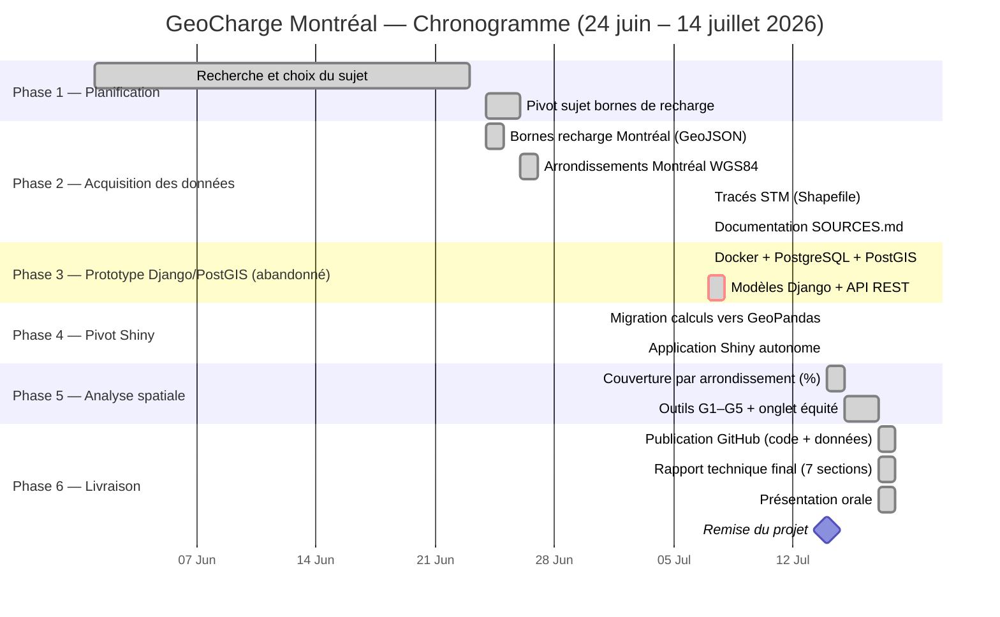

# Chronogramme — GeoCharge Montréal
## GMQ580 — Géomatique Informatique 2 — Été 2026

> **Contrainte de livraison : avant le 15 juillet 2026**
> Durée totale : 21 jours (24 juin → 14 juillet 2026)

---

## Vue d'ensemble des phases

| Phase | Description | Statut |
|---|---|---|
| Phase 1 | Planification et choix du sujet | ✅ Complété |
| Phase 2 | Acquisition des données ouvertes | ✅ Complété |
| Phase 3 | Prototype Django + PostGIS + Docker | ⚠️ Abandonné (trop lourd pour une démo en classe) |
| Phase 4 | Pivot vers Shiny for Python + GeoPandas | ✅ Complété (14 juillet 2026) |
| Phase 5 | Analyse spatiale et outils de décision (G1–G5) | ✅ Complété |
| Phase 6 | Documentation, rapport, présentation | ✅ Complété |

---

## Diagramme de Gantt

---

## Détail par phase

### Phase 1 — Planification (juin 2026) ✅

| Tâche | Livrable |
|---|---|
| Choix du sujet : accessibilité bornes recharge Montréal | Problématique validée |
| Définition de la question de recherche | Où installer de nouvelles bornes ? |

---

### Phase 2 — Acquisition des données (24 juin – 7 juillet 2026) ✅

| Source | Format | Contenu | Licence |
|---|---|---|---|
| Ville de Montréal (Données Québec) | GeoJSON | 2 412 bornes de recharge publiques | CC-BY 4.0 |
| Ville de Montréal (Données Québec) | GeoJSON | Arrondissements WGS84 (34 unités) | CC-BY 4.0 |
| STM (Données Québec) | Shapefile | Stations de métro + lignes | CC-BY 4.0 |
| Statistique Canada | — | Recensement 2021 (19 arrondissements) | CC-BY 4.0 |

---

### Phase 3 — Prototype Django/PostGIS (7 juillet 2026) ⚠️ Abandonné

Une première version utilisait Django, PostgreSQL/PostGIS et Docker pour l'application web. Cette architecture, bien que réaliste pour une mise en production, s'est révélée lourde à faire fonctionner pour une simple démonstration en classe (base de données à démarrer, conteneur à configurer). Elle a été **remplacée** par l'approche décrite en Phase 4.

---

### Phase 4 — Pivot vers Shiny for Python (14 juillet 2026) ✅

| Tâche | Résultat |
|---|---|
| Remplacement de PostGIS par GeoPandas (calculs en mémoire) | Aucune base de données requise |
| Remplacement de Django/API REST par Shiny for Python | Application réactive, un seul processus |
| Carte Folium/Leaflet intégrée directement à l'app | `shiny_app/app.py` |

---

### Phase 5 — Analyse spatiale et outils de décision (Complété) ✅

| Tâche | Résultat |
|---|---|
| Buffers 500 m (EPSG:32188) + couverture par arrondissement | 45,2 % de couverture moyenne |
| G1 — Parcs sans borne à proximité | 1 413 / 1 541 parcs sous le seuil |
| G2 — Épiceries sans borne à 300 m | 819 / 3 010 épiceries |
| G3 — Score de priorité composite (5 critères pondérés) | Classement des 19 arrondissements |
| G4 — Corrélation multi-facteurs | Densité (r = 0,875) domine, pas le revenu (r = −0,60) |
| G5 — Intermodalité STM | 7 / 72 stations sans borne à 500 m |

---

### Phase 6 — Livraison ✅

| Tâche | Fichier | Statut |
|---|---|---|
| Push GitHub complet (code + données) | GitHub | ✅ |
| Rapport technique final | RAPPORT_FINAL.md (remis séparément) | ✅ 7 sections |
| Présentation orale | PRESENTATION_ORALE.md (remis séparément) | ✅ |

---

## Jalons clés

| Date | Jalon | Statut |
|---|---|---|
| 24 juin 2026 | Démarrage du projet | ✅ |
| 7 juillet 2026 | Toutes les données acquises | ✅ |
| 7 juillet 2026 | Prototype Django/PostGIS abandonné (trop lourd pour la démo) | ⚠️ |
| 14 juillet 2026 | Pivot vers Shiny for Python complété | ✅ |
| 17–18 juillet 2026 | Analyse spatiale, outils G1–G5, documentation finalisés | ✅ |
| **14 juillet 2026** | **Remise finale du projet** | ✅ |

---

## Stratégies adoptées

| Défi | Solution choisie |
|---|---|
| Données d'imagerie satellitaire difficiles à obtenir | Pivot vers données ouvertes Ville de Montréal (immédiatement disponibles, CC-BY 4.0) |
| Architecture Django + PostGIS + Docker trop lourde pour une démo en classe | Pivot vers Shiny for Python + GeoPandas, calculs en mémoire, une seule commande à lancer |
| API Overpass (OpenStreetMap) indisponible | Données de parcs/épiceries récupérées via Données Québec |
| Données de revenu StatCan au format IVT non exploitable par programme | Extraction manuelle des variables clés (revenu médian, etc.) par arrondissement |

---

*Chronogramme révisé le 18 juillet 2026 — Équipe : Modou Khabane Mbaye & Rahina Djelila Sarah Bagre*
*GMQ580 Géomatique Informatique 2 — Université de Sherbrooke — Été 2026*
