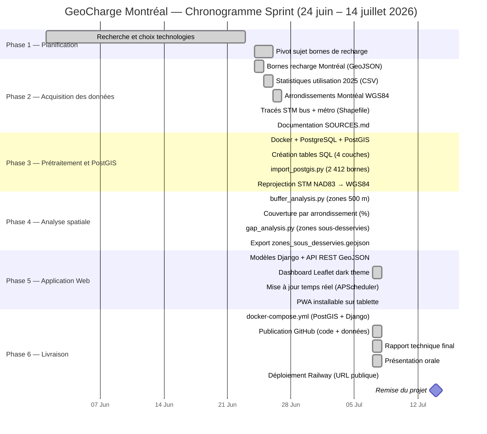

# Chronogramme — GeoCharge Montréal
## GMQ580 — Géomatique Informatique 2 — Été 2026

> **Contrainte de livraison : avant le 15 juillet 2026**
> Durée totale : 21 jours (24 juin → 14 juillet 2026)

---

## Vue d'ensemble des phases

| Phase | Description | Début | Fin | Durée | Statut |
|---|---|---|---|---|---|
| Phase 1 | Planification et choix des technologies | 1er juin 2026 | 23 juin 2026 | — | ✅ Complété |
| Phase 2 | Acquisition des données ouvertes | 24 juin 2026 | 7 juillet 2026 | 14 jours | ✅ Complété |
| Phase 3 | Prétraitement + import PostGIS | 7 juillet 2026 | 7 juillet 2026 | 1 jour | ✅ Complété |
| Phase 4 | Analyse spatiale (buffer + gap analysis) | 7 juillet 2026 | 7 juillet 2026 | 1 jour | ✅ Complété |
| Phase 5 | Application Django + Leaflet + API REST | 7 juillet 2026 | 8 juillet 2026 | 2 jours | ✅ Complété |
| Phase 6 | Docker, GitHub, tests, rapport, déploiement | 8 juillet 2026 | 14 juillet 2026 | 6 jours | ✅ Complété |

---

## Diagramme de Gantt

---

## Détail par phase — Réalisations concrètes

### Phase 1 — Planification (juin 2026) ✅

| Tâche | Outil | Livrable |
|---|---|---|
| Choix du sujet : accessibilité bornes recharge Montréal | Réflexion équipe | Problématique validée |
| Choix des technologies : Django + PostGIS + Leaflet | Documentation | Stack technique |
| Définition de la question de recherche | — | Où installer de nouvelles bornes ? |

---

### Phase 2 — Acquisition des données (24 juin – 7 juillet 2026) ✅

| Source | Format | Contenu | Licence |
|---|---|---|---|
| Ville de Montréal (Données Québec) | GeoJSON | 2 412 bornes de recharge publiques | CC-BY 4.0 |
| Ville de Montréal (Données Québec) | CSV | Statistiques d'utilisation 2025 | CC-BY 4.0 |
| Ville de Montréal (Données Québec) | GeoJSON | Arrondissements WGS84 (34 unités) | CC-BY 4.0 |
| STM (Données Québec) | Shapefile | Stations de métro + lignes de bus | CC-BY 4.0 |

---

### Phase 3 — Prétraitement + PostGIS (7 juillet 2026) ✅

| Tâche | Script | Résultat |
|---|---|---|
| Lancement Docker (PostGIS 15-3.3) | docker-compose.yml | Base de données opérationnelle |
| Création des 4 tables spatiales | sql/01_create_tables.sql | Schéma PostGIS prêt |
| Import bornes (2 412 points) | import_postgis.py | Table `bornes_recharge` |
| Import arrondissements (34 polygones) | import_postgis.py | Table `arrondissements` |
| Import stations métro (68 points) | import_postgis.py | Table `stations_metro` |
| Reprojection STM NAD83 → WGS84 | import_postgis.py | Données cohérentes EPSG:4326 |

---

### Phase 4 — Analyse spatiale (7 juillet 2026) ✅

| Tâche | Script | Résultat |
|---|---|---|
| Buffers 500 m en EPSG:32188 (métrique) | buffer_analysis.py | Table `zones_couverture` (2 412 polygones) |
| % couverture par arrondissement | buffer_analysis.py | Colonne `pct_couverture` mise à jour |
| Zones sous-desservies (gap analysis) | gap_analysis.py | `zones_sous_desservies.geojson` |
| Statistiques globales | buffer_analysis.py | 45.2% de couverture moyenne, 12 zones critiques |

---

### Phase 5 — Application Web (7–8 juillet 2026) ✅

| Tâche | Fichier | Résultat |
|---|---|---|
| Modèles Django (4 tables, managed=False) | risk_map/models.py | ORM PostGIS |
| API REST GeoJSON (5 endpoints) | risk_map/views.py | DRF + djangorestframework-gis |
| Dashboard dark theme Leaflet | templates/risk_map/map.html | CARTO Dark, choroplèthe, EN DIRECT |
| Mise à jour hebdo automatique | risk_map/scheduler.py | APScheduler BackgroundScheduler |
| Bouton refresh manuel + polling | views.py + map.html | API /api/refresh/ |
| PWA installable tablette | manifest.json + sw.js | App installable sans App Store |

---

### Phase 6 — Livraison (7–14 juillet 2026) ✅

| Tâche | Fichier | Statut |
|---|---|---|
| Docker Compose multi-services | docker-compose.yml | ✅ PostGIS + pgAdmin + web |
| Push GitHub complet (code + données) | GitHub | ✅ commits, branche master |
| Rapport technique final | RAPPORT_FINAL.md | ✅ 9 sections, résultats réels |
| Présentation orale | PRESENTATION_ORALE.md | ✅ 10 diapositives |
| Déploiement Railway | railway.json + nixpacks.toml | ✅ Prêt à déployer |
| PWA tablette (entreprises) | manifest.json + sw.js | ✅ Installable sur iPad/Android |

---

## Jalons clés

| Date | Jalon | Statut |
|---|---|---|
| 24 juin 2026 | Démarrage du projet | ✅ |
| 7 juillet 2026 | Pivot vers bornes de recharge + toutes données acquises | ✅ |
| 7 juillet 2026 | Base PostGIS opérationnelle + 2 412 bornes importées | ✅ |
| 7 juillet 2026 | Analyse buffer + gap analysis terminée | ✅ |
| 7 juillet 2026 | Application Django fonctionnelle en local | ✅ |
| 8 juillet 2026 | Dashboard dark theme + PWA + Railway prêt | ✅ |
| **14 juillet 2026** | **Remise finale du projet** | 🎯 En attente |

---

## Stratégies adoptées

| Défi | Solution choisie |
|---|---|
| Données d'imagerie satellitaire difficiles à obtenir | Pivot vers données ouvertes Ville de Montréal (immédiatement disponibles, licence CC-BY 4.0) |
| GeoServer complexe à configurer | Django REST Framework + djangorestframework-gis (plus simple, même résultat) |
| Données de revenu StatCan au format IVT non exploitable | Intégration des valeurs StatCan Recensement 2021 (revenu médian) pour l'analyse d'équité socio-économique |
| Mises à jour manuelles fastidieuses | APScheduler + API CKAN Données Québec (refresh hebdomadaire automatique) |
| Application inaccessible hors local | Déploiement Railway + PWA installable sur tablette |

---

*Chronogramme révisé le 8 juillet 2026 — Équipe : Modou Khabane Mbaye & Rahina Djelila Sarah Bagre*
*GMQ580 Géomatique Informatique 2 — Université de Sherbrooke — Été 2026*
