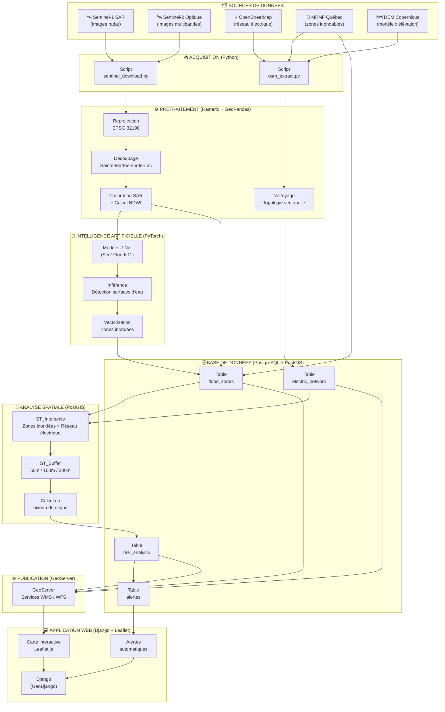
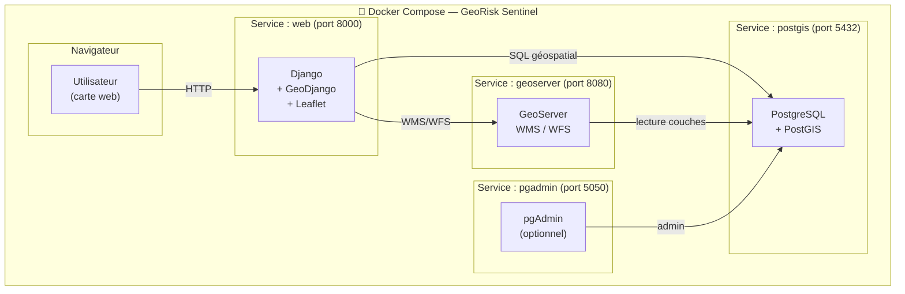
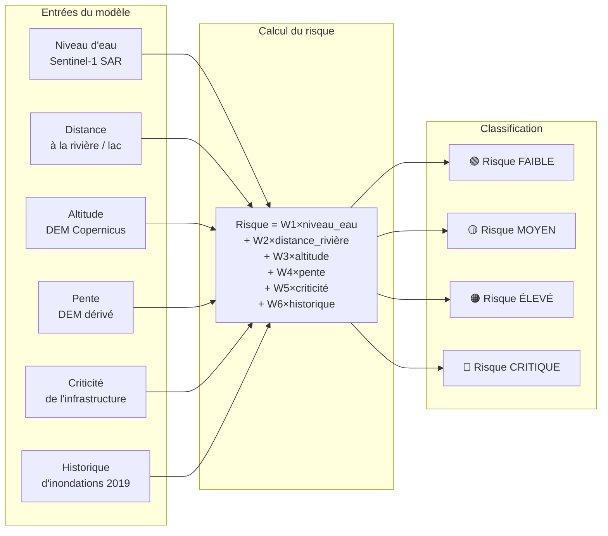
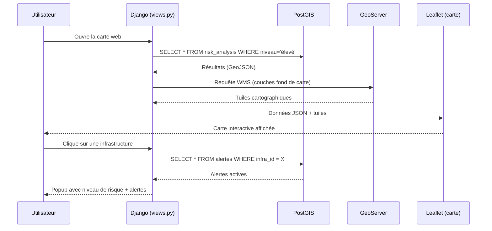

# Diagramme Mermaid — GeoRisk Sentinel

## Comment utiliser ce diagramme dans Draw.io

1. Ouvrir **Draw.io** (app.diagrams.net)
2. Menu **Extras** → **Edit Diagram**
3. Copier-coller le code ci-dessous
4. Cliquer **OK**
5. OU : Menu **Organiser** → **Insérer** → **Mermaid** → coller et confirmer

---

## Diagramme 1 — Pipeline de traitement complet

---

## Diagramme 2 — Architecture des services Docker

---

## Diagramme 3 — Modèle de risque multicritère

---

## Diagramme 4 — Flux des données dans Django (GeoDjango)

---

*Fichier à utiliser avec Draw.io — Coller le code Mermaid dans Extras → Edit Diagram*
