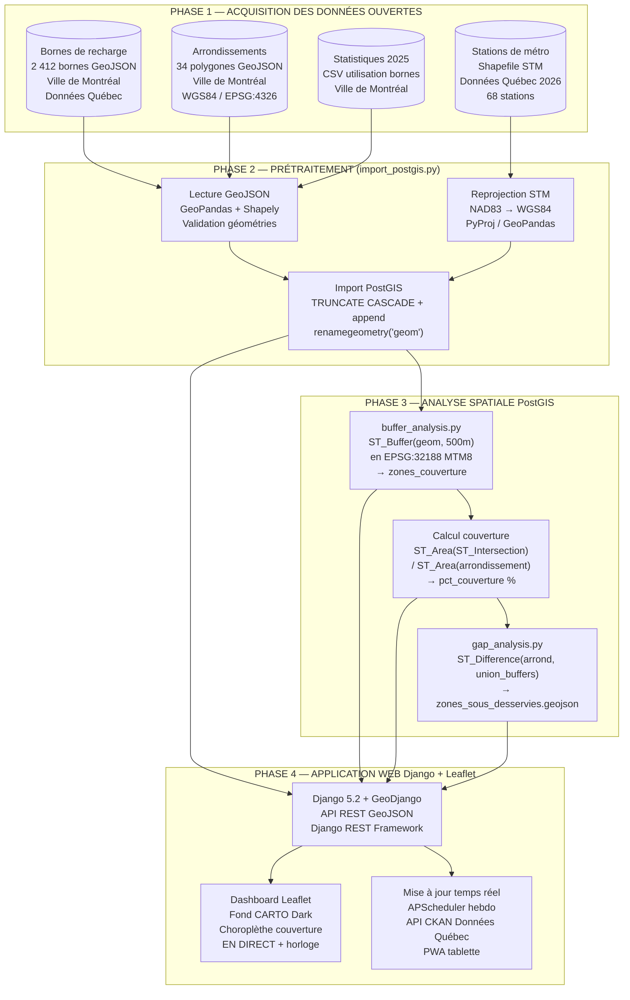
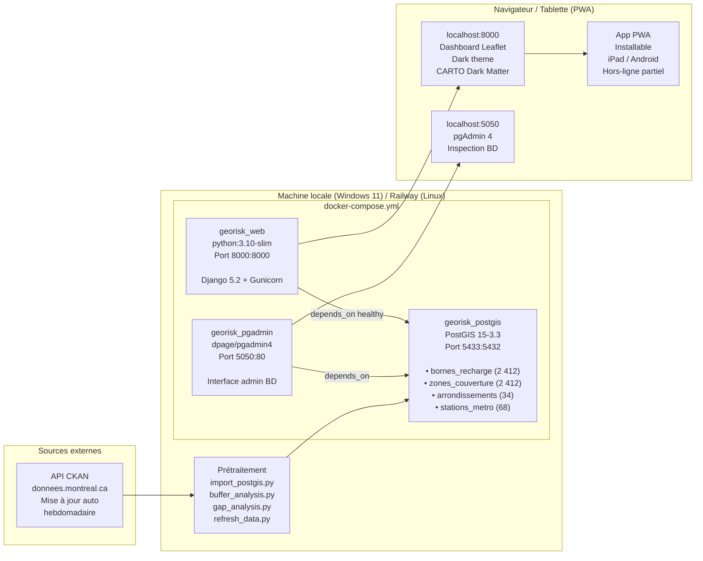
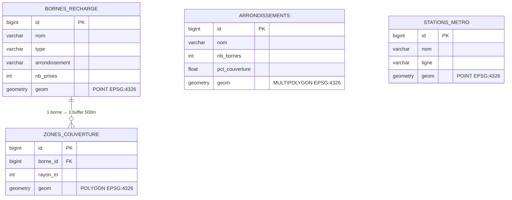
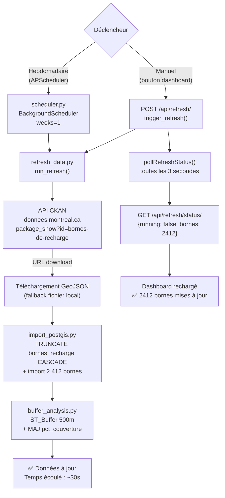
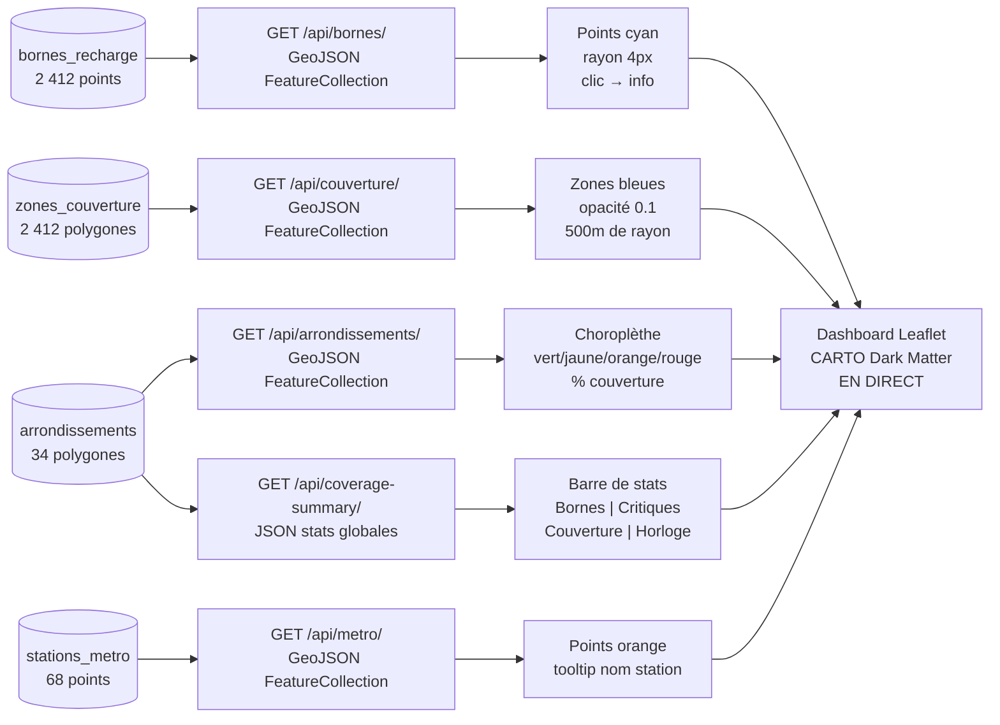

# Diagrammes Mermaid — GeoRisk Sentinel
## Pour utilisation dans Draw.io / GitHub

**Comment utiliser dans Draw.io :**
1. Ouvrir [app.diagrams.net](https://app.diagrams.net)
2. Menu **Extras** → **Edit Diagram**
3. Coller le code du diagramme voulu → cliquer **OK**

> Ces diagrammes sont aussi rendus automatiquement dans GitHub (Mermaid natif).

---

## Diagramme 1 — Pipeline de traitement complet

---

## Diagramme 2 — Architecture technique

---

## Diagramme 3 — Modèle de données PostGIS

---

## Diagramme 4 — Workflow de mise à jour automatique

---

## Diagramme 5 — API REST et dashboard

---

*GeoRisk Sentinel — GMQ580 Géomatique Informatique 2 — Été 2026 — Université de Sherbrooke*
*Équipe : Modou Khabane Mbaye & Rahina Djelila Sarah Bagre*
