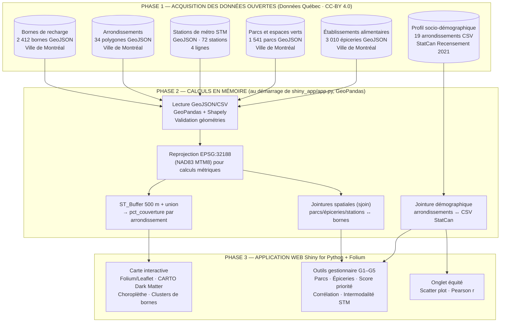
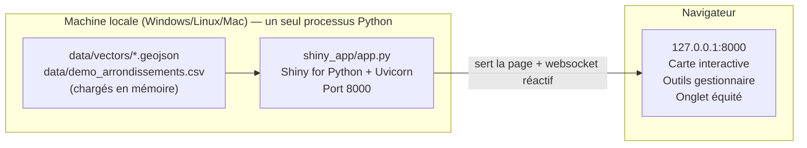
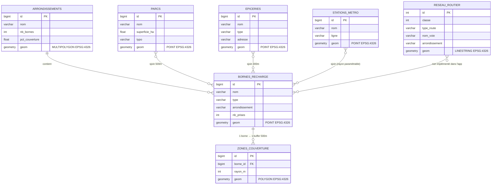
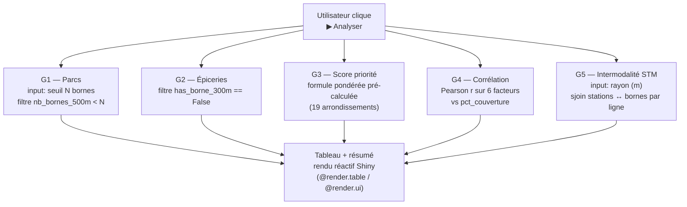

# Diagrammes Mermaid — GeoCharge Montréal
## Pour utilisation dans Draw.io / GitHub

**Comment utiliser dans Draw.io :**
1. Ouvrir [app.diagrams.net](https://app.diagrams.net)
2. Menu **Extras** → **Edit Diagram**
3. Coller le code du diagramme voulu → cliquer **OK**

> Ces diagrammes sont aussi rendus automatiquement dans GitHub (Mermaid natif).
> Ils décrivent l'application **Shiny for Python autonome** (`shiny_app/app.py`) — sans Django, sans PostGIS, sans Docker.

---

## Diagramme 1 — Pipeline de traitement complet

---

## Diagramme 2 — Architecture technique

Aucun conteneur Docker, aucune base de données, aucun service externe requis pour faire tourner l'app —
c'est la principale simplification par rapport à l'architecture Django + PostGIS + Docker envisagée initialement.

---

## Diagramme 3 — Modèle de données logique

> Ce schéma décrit la structure des couches sources et leurs relations spatiales. Dans l'app Shiny,
> ces relations sont calculées **en mémoire avec GeoPandas** à chaque démarrage — `ZONES_COUVERTURE`
> et `RESEAU_ROUTIER` représentent le modèle conceptuel des données, pas des tables réellement matérialisées
> (le réseau routier est disponible dans `data/vectors/` mais n'est pas chargé par l'app actuelle).

---

## Diagramme 4 — Flux réactif des outils gestionnaire (G1–G5)

> Contrairement à l'ancienne architecture Django (API REST + JS côté client), toute la logique
> réactive est ici gérée côté serveur Python par Shiny — pas d'endpoints REST, pas de JavaScript custom.

---

*GeoCharge Montréal — GMQ580 Géomatique Informatique 2 — Été 2026 — Université de Sherbrooke*
*Équipe : Modou Khabane Mbaye & Rahina Djelila Sarah Bagre*
