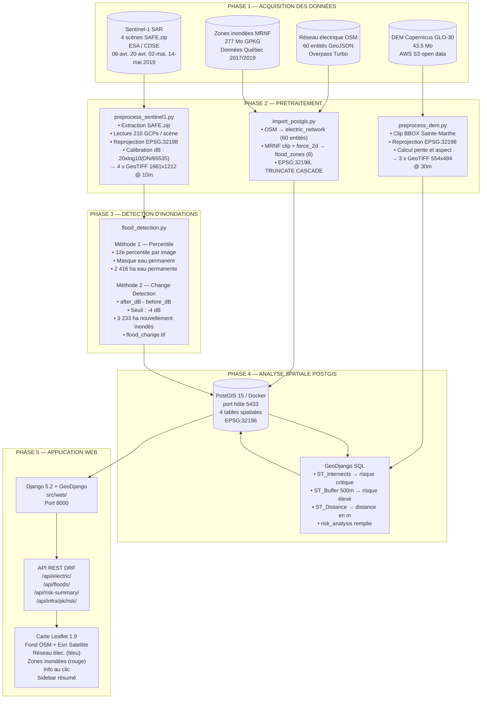
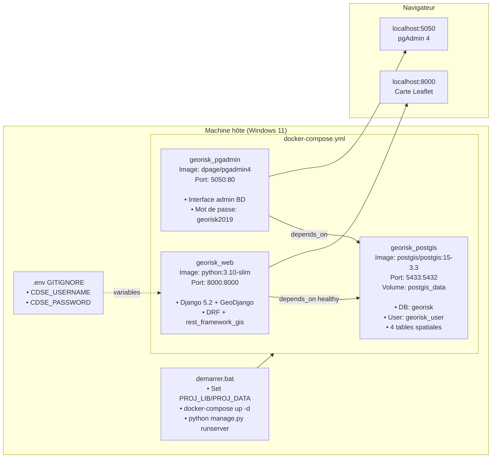
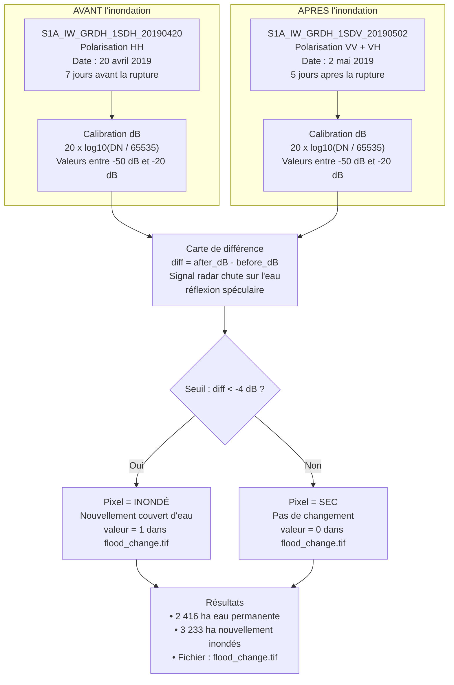
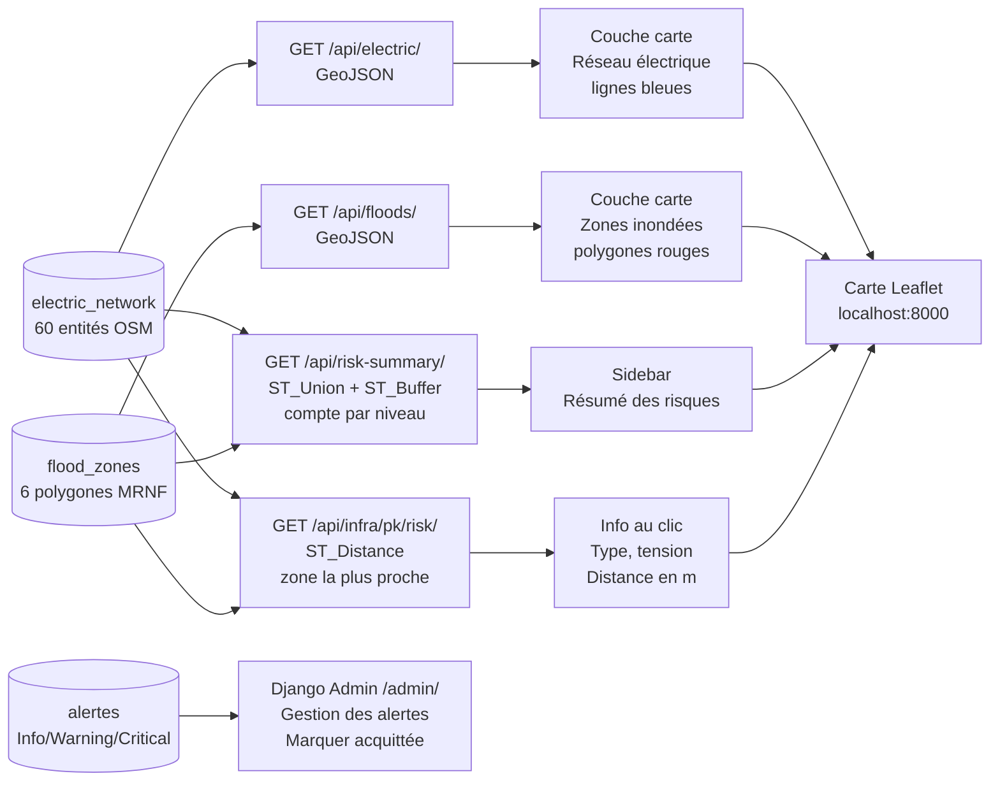
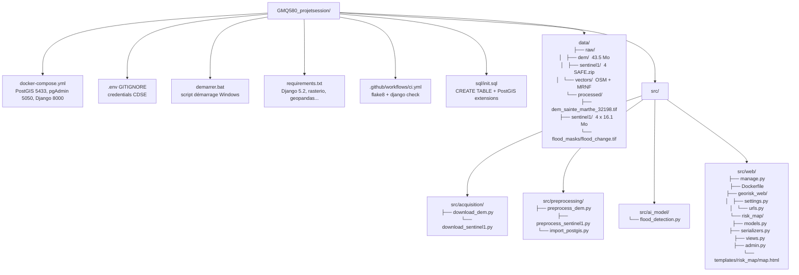

# Diagrammes Mermaid — GeoRisk Sentinel
## Pour utilisation dans Draw.io

**Comment utiliser :**
1. Ouvrir [app.diagrams.net](https://app.diagrams.net)
2. Menu **Extras** → **Edit Diagram**
3. Coller le code du diagramme voulu → cliquer **OK**

---

## Diagramme 1 — Pipeline de traitement complet (flowchart)

---

## Diagramme 2 — Architecture Docker et services

---

## Diagramme 3 — Méthode change detection SAR

---

## Diagramme 4 — Analyse des risques et API Django

---

## Diagramme 5 — Structure des fichiers du projet

---

*GeoRisk Sentinel — GMQ580 Géomatique Informatique 2 — Été 2026 — Université de Sherbrooke*
*Equipe : Modou Khabane Mbaye & Rahina Djelila Sarah Bagre*
