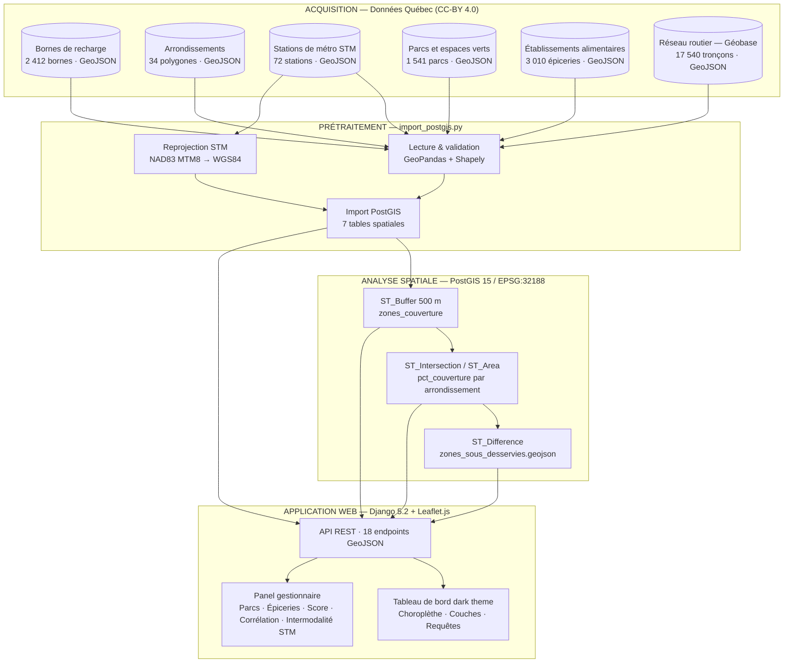
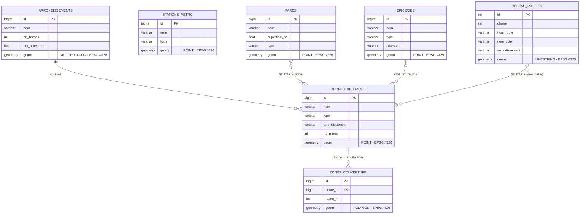

# GeoCharge Montréal
## Accessibilité aux bornes de recharge électrique à Montréal

**Cours :** GMQ580 — Géomatique Informatique 2 · Été 2026 · Université de Sherbrooke

| Nom | Courriel |
|---|---|
| Modou Khabane Mbaye | modou.khabane.mbaye@usherbrooke.ca |
| Rahina Djelila Sarah Bagre | rahina.bagre@usherbrooke.ca |

---

## Documents du projet

| Document | Contenu |
|---|---|
| [RAPPORT_FINAL.md](RAPPORT_FINAL.md) | Rapport technique complet — méthodologie, algorithmes SQL, résultats, réponses aux questions du professeur |
| [PRESENTATION_ORALE.md](PRESENTATION_ORALE.md) | Plan de présentation orale 10 min + réponses préparées aux questions |
| [data/SOURCES.md](data/SOURCES.md) | Fiche de métadonnées de toutes les couches (citations, CRS, filtrage) |
| [DIAGRAMME_MERMAID.md](DIAGRAMME_MERMAID.md) | Diagrammes architecture, pipeline, modèle ER |
| [DEPLOIEMENT.md](DEPLOIEMENT.md) | Instructions déploiement Railway (production) |

---

## Problématique

La distribution des bornes de recharge publiques à Montréal est inégale : les arrondissements centraux concentrent la majorité des installations tandis que les secteurs périphériques en manquent. Il n'existe pas d'outil permettant de quantifier ces disparités ni d'orienter les décisions d'investissement.

**Question de recherche :** Où faudrait-il installer de nouvelles bornes de recharge à Montréal afin de maximiser l'accessibilité des usagers tout en réduisant les zones sous-desservies ?

---

## Données

Toutes les données sont disponibles dans le dossier [`data/`](data/) de ce dépôt, sous licence CC-BY 4.0.

| Couche | Fichier | Source |
|---|---|---|
| Bornes de recharge publiques (2 412 bornes) | [`data/vectors/bornes_recharge_montreal.geojson`](data/vectors/bornes_recharge_montreal.geojson) | Données Québec — Ville de Montréal |
| Statistiques d'utilisation 2025 | [`data/vectors/chargeurs_statistiques_2025.csv`](data/vectors/chargeurs_statistiques_2025.csv) | Données Québec — Ville de Montréal |
| Limites des arrondissements | [`data/vectors/arrondissements_montreal.geojson`](data/vectors/arrondissements_montreal.geojson) | Données Québec — Ville de Montréal |
| Stations de métro STM (72 stations) | [`data/vectors/stations_metro_stm.geojson`](data/vectors/stations_metro_stm.geojson) | Données Québec — STM (lignes Verte, Orange, Bleue, Jaune) |
| **Parcs et espaces verts (1 541 parcs)** | [`data/vectors/parcs_montreal.geojson`](data/vectors/parcs_montreal.geojson) | Données Québec — Ville de Montréal |
| **Établissements alimentaires (3 010 épiceries)** | [`data/vectors/epiceries_montreal.geojson`](data/vectors/epiceries_montreal.geojson) | Données Québec — Ville de Montréal |
| Référentiel concordance quartiers ↔ arrondissements | [`data/quartiers_reference_habitation.csv`](data/quartiers_reference_habitation.csv) | Données Québec — StatCan Recensement 2021 |
| **Profil socio-démographique (19 arrondissements)** | [`data/demo_arrondissements.csv`](data/demo_arrondissements.csv) | StatCan Recensement 2021 (pop, densité, revenu, motorisation, faible revenu) |
| **Réseau routier (17 540 tronçons, CLASSE ≥ 5)** | [`data/vectors/reseau_routier_montreal.geojson`](data/vectors/reseau_routier_montreal.geojson) | Données Québec — Géobase Ville de Montréal (CC-BY 4.0, mis à jour 08 juillet 2026) |

Les zones sous-desservies calculées par l'analyse sont disponibles dans [`data/vectors/zones_sous_desservies.geojson`](data/vectors/zones_sous_desservies.geojson).

---

## Pipeline de traitement



Le rayon de 500 m correspond à la distance de marche accessible recommandée en urbanisme actif (INSPQ, Transports Canada).
La reprojection en EPSG:32188 (NAD83 / MTM zone 8) garantit la précision métrique des buffers.

---

## Fonctionnalités du tableau de bord

- **Choroplèthe** : taux de couverture à 500 m par arrondissement (vert ≥ 60 % · jaune 30-60 % · orange 15-30 % · rouge < 15 %)
- **Couche zones non couvertes** : zones géographiques sans borne issues de `gap_analysis.py`
- **Couche parcs** : 1 541 parcs et espaces verts de l'île de Montréal
- **Couche épiceries** : 3 010 établissements alimentaires (supermarchés, épiceries, boucheries)
- **Requêtes spatiales PostGIS** (4 requêtes classiques) : N bornes les plus proches (KNN `<->`), bornes dans un rayon (`ST_DWithin`), stations de métro sans borne (`NOT EXISTS`), arrondissements peu équipés
- **Outils gestionnaire** (5 analyses décisionnelles) :
  - Parcs sans couverture adéquate (< N bornes à 500 m)
  - Épiceries sans borne à proximité (< rayon paramétrable)
  - Score de priorité composite par arrondissement (couverture 35% + densité 25% + motorisation 15% + équité 15% + faible revenu 10%)
  - Corrélation multi-variable : couverture vs revenu, densité, taux de motorisation, taux de faible revenu
  - Intermodalité STM par ligne de métro : couverture park-and-charge (NOT EXISTS + ST_DWithin)
- **Analyse d'équité** : scatter plot couverture vs revenu médian (StatCan 2021), coefficient de Pearson, droite de régression
- **Simulation** : slider de seuil de sous-desserte avec recoloration de la carte en temps réel
- **Mise à jour automatique** : re-téléchargement hebdomadaire depuis Données Québec (APScheduler + API CKAN)
- **PWA** : installable sur tablette (manifest.json + service worker)

---

---

## Méthodologie — Comment déterminer une zone à développer ?

La méthode combine **trois étapes complémentaires** (détail complet : [RAPPORT_FINAL.md §3.7](RAPPORT_FINAL.md#37-détermination-des-zones-à-développer--méthode-en-trois-étapes)) :

| Étape | Outil | Question répondue |
|---|---|---|
| **A — Identifier géographiquement** | `gap_analysis.py` → `ST_Difference` → polygones rouges sur la carte | *Où* manque-t-il de couverture ? |
| **B — Prioriser l'arrondissement** | `/api/priorite/` → score composite 0–100 (5 critères pondérés) | *Lequel traiter en premier ?* |
| **C — Localiser précisément** | Intersection score + polygones gap | *Où exactement* installer ? |

**Exemple concret :** Montréal-Nord (37 k$ revenu, 10 200 hab/km², 38 % faible revenu) obtient un score de **≈ 72/100** malgré une couverture de 25 %. L'Île-Bizard (8,8 % de couverture mais 520 hab/km², 82 k$) ne score que **≈ 50/100**. La méthode priorise l'**impact humain** sur la simple étendue géographique.

---

> Diagrammes complets (architecture Docker, workflow mise à jour, API) : voir [`DIAGRAMME_MERMAID.md`](DIAGRAMME_MERMAID.md)

## Modèle de données PostGIS



---

## Technologies

| Technologie | Rôle |
|---|---|
| Python 3.10 | Traitement des données, backend |
| Django 5.2 + GeoDjango | API REST GeoJSON, vue carte, scheduler |
| PostgreSQL 15 + PostGIS 3.3 | Stockage spatial, requêtes géographiques |
| GeoPandas 1.0 + PyProj 3.7 | Import vecteur, reprojection CRS |
| Leaflet.js 1.9 | Carte web interactive |
| Docker Compose | Environnement reproductible (PostGIS + pgAdmin) |
| Railway | Déploiement production (voir [DEPLOIEMENT.md](DEPLOIEMENT.md)) |

---

## Démarrage local

```bash
git clone https://github.com/modou5604501/projet_Session.git
cd projet_Session
docker-compose up -d postgis
python -m venv venv && pip install -r requirements.txt
python src/preprocessing/import_postgis.py   # import + buffers 500m + stats
python src/preprocessing/gap_analysis.py     # zones sous-desservies → GeoJSON
cd src/web && python manage.py runserver
# Tableau de bord : http://localhost:8000
```

---

## Références

- Ville de Montréal. *Bornes de recharge publiques*, Données Québec. CC-BY 4.0. Consulté le 7 juillet 2026.
- Ville de Montréal. *Limites administratives de l'agglomération*, Données Québec. CC-BY 4.0. Mis à jour le 30 juin 2026.
- Société de transport de Montréal. *Tracés des lignes et arrêts STM*, Données Québec. CC-BY 4.0. Mis à jour le 6 juillet 2026.
- Statistique Canada. *Commande personnalisée du recensement 2021*, Données Québec. CC-BY 4.0. Consulté le 8 juillet 2026.
- PostGIS Documentation : https://postgis.net/documentation

---

*GMQ580 Géomatique Informatique 2 — Été 2026 — Université de Sherbrooke*
